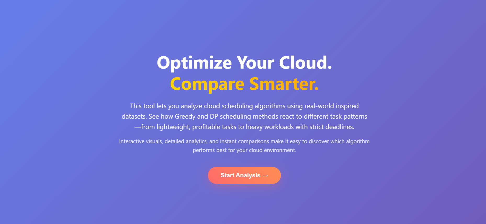
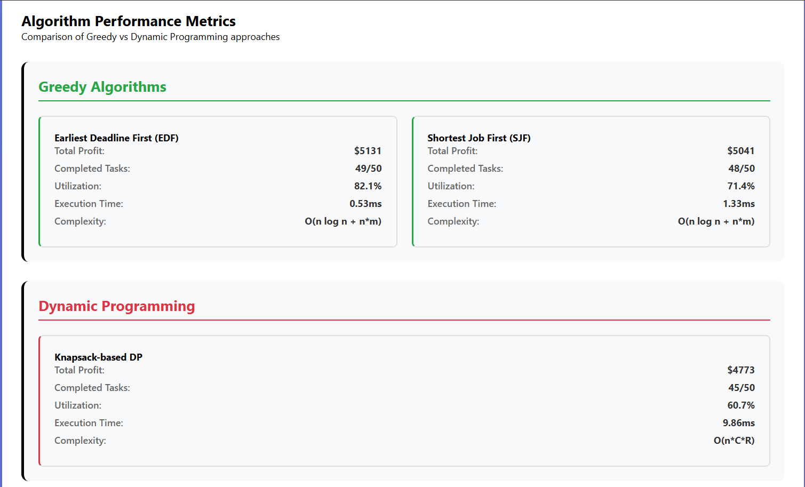
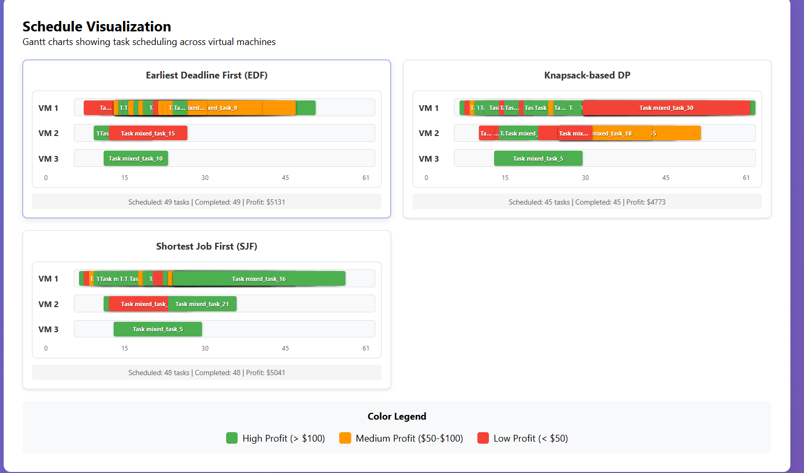

# Cloud Scheduling Visualizer

## 📊 Interactive Comparison of Scheduling Algorithms


[](https://developer.mozilla.org/en-US/docs/Web/JavaScript)
[](https://developer.mozilla.org/en-US/docs/Web/HTML)
[](https://developer.mozilla.org/en-US/docs/Web/CSS)

An interactive web application for visualizing and comparing task scheduling algorithms in cloud computing environments.

## 🎯 Features

- **Three Scheduling Algorithms**:
  - Greedy Earliest Deadline First (EDF)
  - Dynamic Programming (3D Knapsack)
  - Shortest Job First (SJF)
  
- **Interactive Visualization**:
  - Real-time scheduling timeline
  - Resource utilization charts
  - Comparative performance metrics
  
- **Dynamic Configuration**:
  - Adjustable CPU/RAM limits (1-20 units)
  - Three test scenarios: Mixed, Worst, Best cases
  - 50-task datasets with varying properties
  
- **Performance Analysis**:
  - Total profit calculation
  - Task completion rates
  - Resource utilization metrics
  - Execution time comparison

## 📈 Results Summary

| Scenario | Best Algorithm | Profit | Completion Rate |
|----------|----------------|--------|-----------------|
| Mixed Case | **EDF** | $5,131 | 98% |
| Worst Case | **EDF** | $1,354 | 60% |
| Best Case | All (Tie) | $6,025 | 100% |

## 🚀 Quick Start

## 📸 Screenshots

### Main Interface

*Interactive dashboard with algorithm controls and resource sliders*

### Results Comparison

*Side-by-side comparison of EDF, DP, and SJF algorithms*

### Timeline Visualization

*Real-time scheduling timeline showing task execution*

### Resource Utilization

*CPU and RAM utilization graphs for each algorithm*

### Local Installation
```bash
# Clone the repository
git clone https://github.com/YOUR-USERNAME/cloud-scheduling-visualizer.git

# Navigate to project
cd cloud-scheduling-visualizer

# Open in browser
open index.html  # Mac
start index.html # Windows
# OR simply double-click index.html
